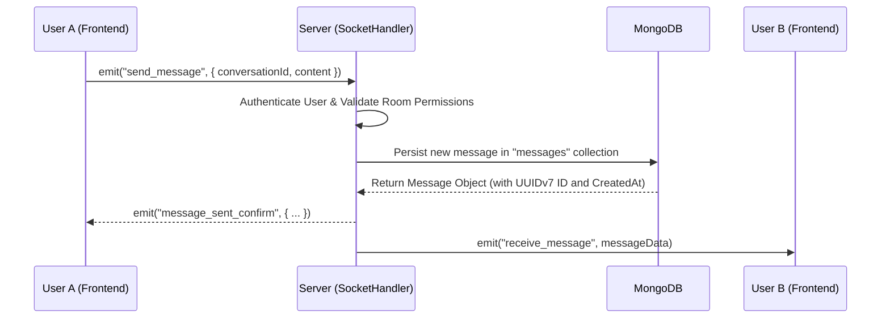

# WebSocket Flow & Real-time Communication

BamboChat uses **Socket.io** to manage real-time communication between users. This document explains the underlying logic and event structure.

---

## 1. Connection Lifecycle

When a user successfully logs into the Frontend:
1.  The client calls `connectSocket(token)`.
2.  The JWT token is passed via the `auth` object during the handshake.
3.  The Server validates the token:
    *   **Valid**: Connection accepted; `socket.id` is mapped to the `user_id`.
    *   **Invalid**: Connection refused.

---

## 2. Messaging Sequence

---

## 3. Main Events

### Client Emits (Input)
*   **`send_message`**: Dispatches new text content.
*   **`typing`**: Notifies others in the chat that the user is currently composing a message.
*   **`join_conversation`**: Enters a specific "Room" to receive targeted room broadcasts.

### Client Listens (Output)
*   **`receive_message`**: Receives fresh messages from other participants in real-time.
*   **`user_online_status`**: Real-time updates when friends come online or go offline.
*   **`friend_request`**: Notification triggered when a new friend request is received.

---

## 4. Implementation Details

*   **Rooms Architecture**: Each conversation (`conversation_id`) is treated as a unique Socket.io Room. The server broadcasts messages exclusively to sockets joined to that specific room. This handles both **1-on-1 Direct Messages** and **Multi-user Group Chats**.
*   **Offline Handling**: If a user is offline, the message is still persisted in the database. When the user reconnects, the Frontend fetches missed history via the `/messages` REST API endpoint.
*   **State Management**: Real-time status (`user_online_status`) is maintained by tracking active socket heartbeats on the server.
